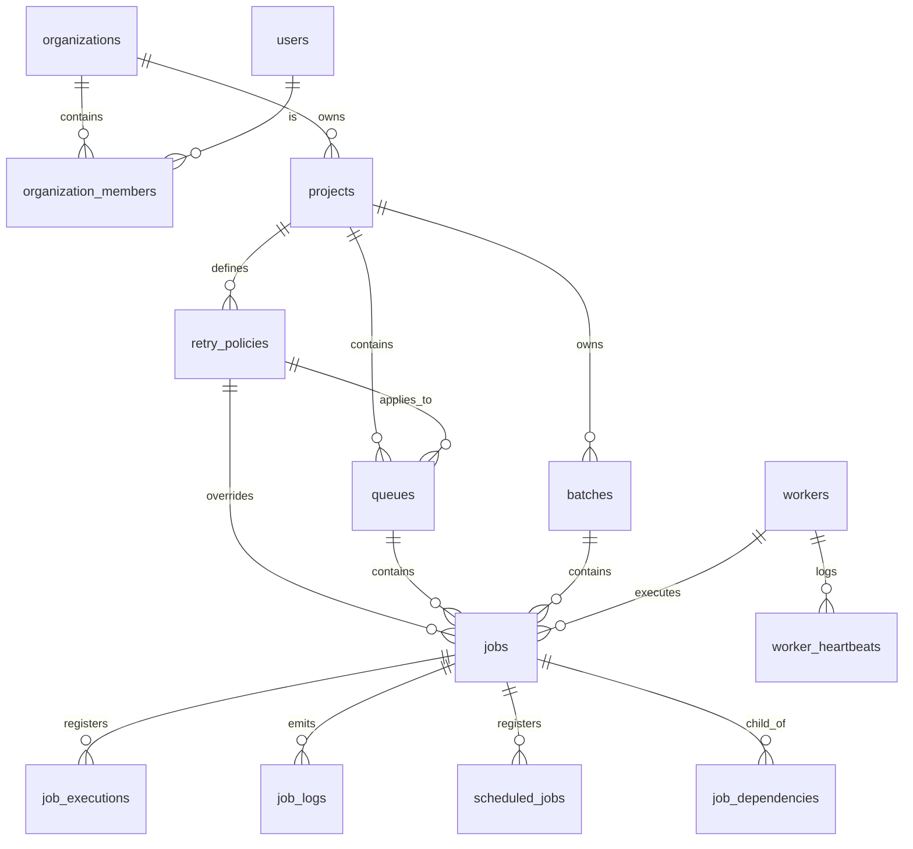

# System Architecture & Database Schema Guide

This document outlines the distributed runtime architecture and the fully normalized relational database schema of the job scheduling platform.

---

## 1. High-Level System Architecture

The platform is designed around a **Single-Source-of-Truth Database Architecture**, using **SQLite in Write-Ahead Log (WAL) mode** to coordinate states across multiple concurrent processes.

```mermaid
graph TD
    subgraph Frontend Layer
        Dash[Vite React Dashboard]
    end

    subgraph Backend API Layer
        Server[Express REST Server]
        SSE[SSE Live Events Stream]
    end

    subgraph Background Execution Layer
        Worker1[Worker Node A]
        Worker2[Worker Node B]
    end

    subgraph Storage Layer
        DB[(SQLite WAL Database)]
    end

    Dash -->|REST APIs| Server
    Dash <==|Real-time Telemetry| SSE
    Server -->|Read / Write State| DB
    Worker1 -->|Atomic Claims / Telemetry| DB
    Worker2 -->|Atomic Claims / Telemetry| DB
    Server -.->|Broadcast Status| SSE
```

### Components

1. **Vite React Dashboard**: Displays real-time job logs, active worker node metrics, and queue capacity metrics. Features live chart telemetry via Server-Sent Events (SSE).
2. **Express REST Server**: Implements endpoints for authentication, role-based access control (RBAC), retry policy CRUD, and job submission (immediate, delayed, recurring, batch). Protects dispatch routes with a token-bucket rate limiter.
3. **Background Worker Daemon**: Polling processes running infinite claim-execute loops. Atomic claiming transactions ensure no job is double-claimed. Workers write heartbeat telemetry to track system load.

---

## 2. Database Schema (Entity-Relationship Layout)

Below is the normalized schema definition implemented in the database:

### ER Diagram



### Table Definitions

#### `users`
- `id` (TEXT PRIMARY KEY): Unique UUID.
- `username` (TEXT UNIQUE): Login username.
- `email` (TEXT UNIQUE): E-mail.
- `password_hash` (TEXT): Encrypted credential hash.
- `created_at` / `updated_at` (INTEGER): Epoch millisecond timestamps.

#### `organizations` & `organization_members`
- Facilitates multitenancy and role-based permissions (RBAC).
- `role` (TEXT): Owner vs. Member privileges for partition validation.

#### `projects`
- Namespace boundary. Owns queues, retry policies, and jobs.

#### `retry_policies`
- Custom configurations for backoff delays.
- Columns: `strategy` ('exponential' | 'linear' | 'fixed'), `delay_ms` (integer), `max_retries` (integer).

#### `queues`
- `priority` (INTEGER): Evaluation sorting weight.
- `concurrency_limit` (INTEGER): Peak active threads allowed.
- `retry_policy_id` (TEXT, FK): Default policy linked to this queue.
- `is_paused` (INTEGER): Active execution gate.

#### `jobs`
- Core job registry tracking execution lifecycle.
- `status` (TEXT): 'queued' | 'scheduled' | 'claimed' | 'running' | 'completed' | 'failed' | 'cancelled'.
- `run_at` (INTEGER): Target execution epoch timestamp.
- `attempt_number` (INTEGER): Current execution iteration.
- `retry_policy_id` (TEXT, FK): Optional custom policy override for this job.

#### `scheduled_jobs`
- Registry tracking scheduled and recurring executions for quick indexing.
- Removed atomically upon worker lock claiming.

#### `worker_heartbeats`
- Telemetry logging for registered processing workers over time. Pruned regularly.

#### `distributed_locks`
- Lease-based coordination locking mapping key resource identifiers. Prevent duplicate executions.
- `key` (TEXT PRIMARY KEY), `holder` (TEXT), `expires_at` (INTEGER).
